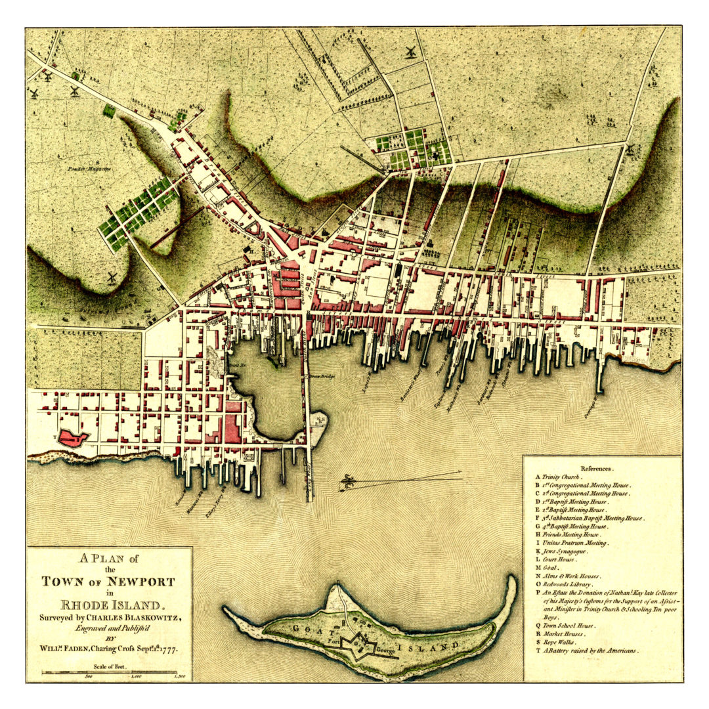
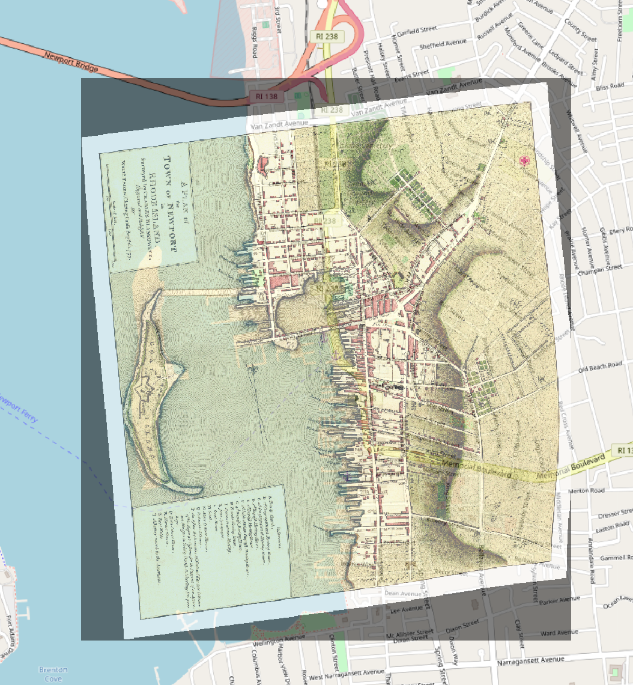

# Newport 1777

This map was published by [William Faden](https://en.wikipedia.org/wiki/William_Faden) in 1777, digitized and enhanced by and downloaded from [Knowol](http://www.knowol.com/information/rhode-island/map-newport-rhode-island-1777/).

## Georeferenced Map

**The map is still in progress!**

`Newport-RI-1777-sm_spline.tif` is a  [geotiff](https://en.wikipedia.org/wiki/GeoTIFF) file georeferenced using QGIS 3.0, referenced to [OpenStreetMap data](http://openstreetmap.org) and [USGS Topographic Maps from RIGIS](http://www.rigis.org/pages/us-topo-maps).  The reference points are in the `Newport-RI-1777-sm.jpg.points` file.  The image was transformed using the QGIS 3.0 Thin Plate Spline transformation with cubic resampling.  Transformation statistics are reported in `Newport-RI-1777-sm_spline.tif.aux.xml`.  The file is in the _NAD 1983 Rhode Island State Plane_ CRS (EPSG:102730).

 This work is licensed under a <a rel="license" href="http://creativecommons.org/licenses/by-nc/3.0/us/">Creative Commons Attribution-NonCommercial 3.0 United States License</a>.
